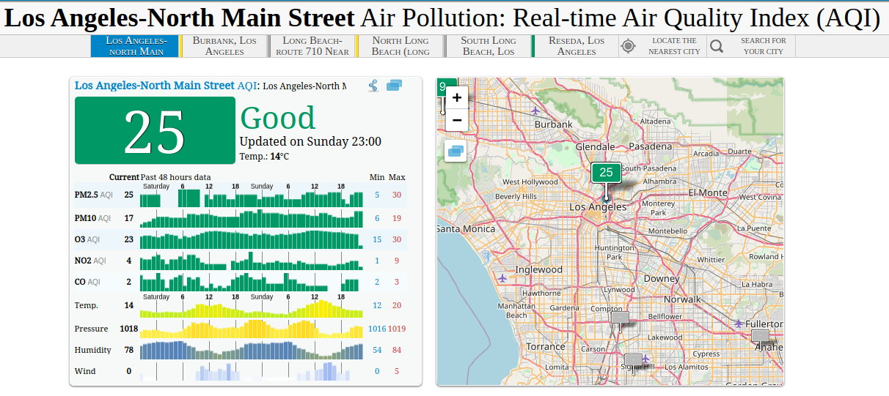
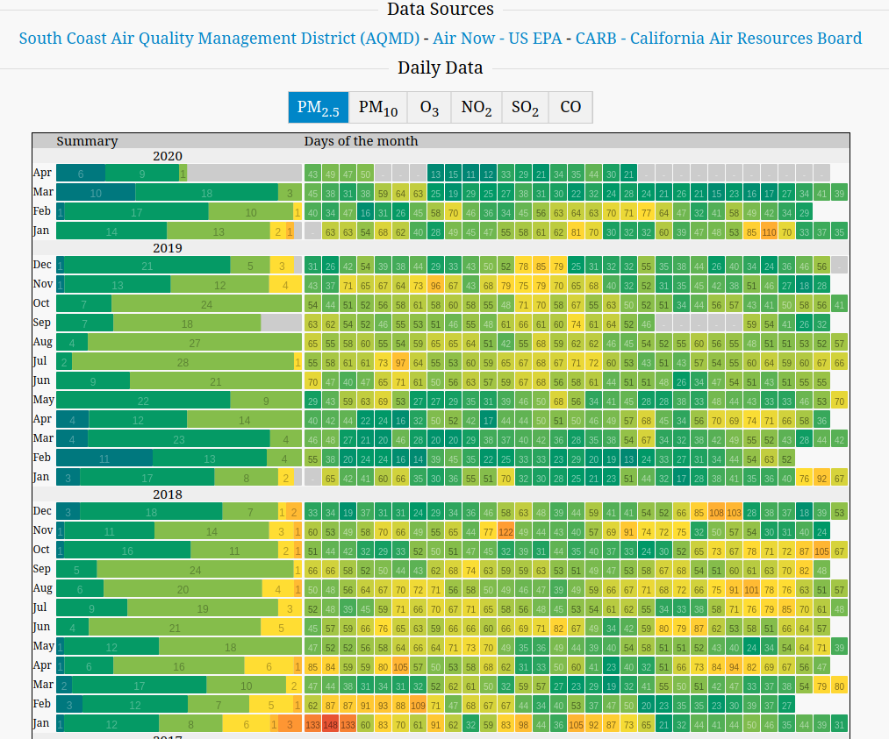
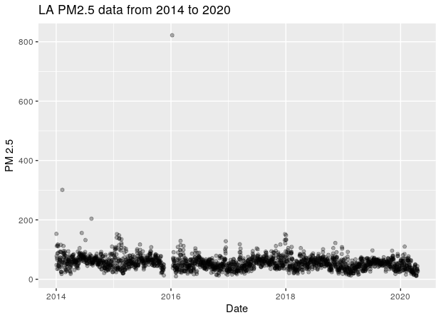
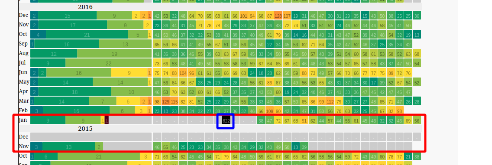

# Analysis of PM 2.5 Air Quality in Los Angeles During Quarantine using CausalImpact and BSTS

With the recent COVID-19 pandemic, the implementation of quarantine and social distancing by various governments created a ripple of effects that affect cities all around the world. The key driver behind this was the halting of economic activity which brought about a big crunch in the global economy. In the early phase of the COVID-19 crisis, the media reported that [the carbon emissions in China was reduced drastically](https://www.nytimes.com/2020/02/26/climate/nyt-climate-newsletter-coronavirus.html) in mid Feb 2020.  This gave me an idea as I wanted to try out some time series analysis on air quality in certain cities with the implementation of a quarantine. 

I was always interested in learning the Bayesian Structured Time Series (BSTS) methodology for time series analysis, and had been doing some research on the `bsts` package. Going down the rabbit hole, I found another package called `CausalImpact` that was developed on top of the `bsts` package which allows for causal analysis of time series experiments. Although relatively unknown, both packages were developed by the smart guys working at Google. If you haven't heard about them, I highly encourage you to check them out.

In this article, I will be assessing the air quality of Los Angeles city and the impact of the quarantine. The following points frame my analysis:
- The type of air quality used for this analysis is the PM2.5, which stands for atmospheric particulate matter with a diameter of less than 2.5 micrometers. 
- The implementation of the quarantine will be perceived as an "intervention". The date of this intervention will be explained in more detail.
- Los Angeles was chosen because it is such an iconic city that is bustling with activity. Not only that, it is also know for its traffic congestion which contributes to the PM 2.5 levels.
- The air quality data will be aggregated by calendar week

## Data Source 

The data for this was taken from [The World Air Quality Project](https://aqicn.org/city/losangeles/los-angeles-north-main-street/). The particular data measurement point is at North Main Street, which is pretty central in terms of Los Angeles.

The World Air Quality Project works with the following sources:
- [South Coast Air Quality Management district (AQMD)](http://www.aqmd.gov/)
- [Air Now (US EPA)](https://www.airnow.gov/)
- [California Air Resources Board (CARB)](https://ww2.arb.ca.gov/)

As shown in the following screenshot, you get to pick the different air quality types. I chose PM2.5 primarily because the values were nominally higher compared to the others, which allows for us to capture a reduction in air quality. The heatmap below shows the daily observations of the data with "cool" colours (like blue or green) representing lower values while hot colours (like yellow or red) representing high values. In addition, we also observe greyed out boxes which represent missing data. 

## EDA and Data Analysis

At the point of this analysis, the data I downloaded was from Jan 2014 to 19th April 2020. A simple plot reveals a glaring outlier in Jan 2016 is extremely high of 800 in value which is unlikely. In addition to that, there is also a missing chunk of data leading up to the outlier.

Corroborating that with the heatmap chart, we observe that:
- There is missing data from the second half of November 2015 to mid Jan 2016 (shown by the red rectangle)
- The outlier data has a value of 822, and occurred in the midst of the missing data period.

Based on that, it seems that perhaps the measurement instrument might have had a prolonged failure/outage which resulted in 2 months worth of missing data. Any attempts for data imputation is highly questionable as the extended period of missing data makes it hard to determine the basis for imputation. 

For the purpose of the analysis, I decided to trim down the data to mid Jan 2016. At the same time, I will be aggregating the data on a weekly basis which is an intentional choice that allows me not to perform any unnecessary imputation of the missing data.

## Intervention Timing

Based on my research of Los Angeles news search, [a public health emergency was declared in LA County over the coronavirus](https://www.dailynews.com/2020/03/04/public-health-emergency-declared-in-la-county-over-coronavirus/) on Wednesday March 4th 2020. 